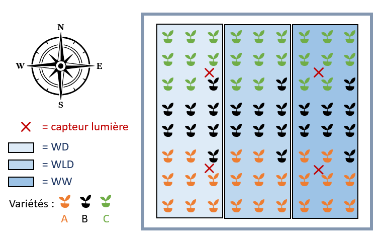

```{r setup, include = FALSE}
# Pour éviter que Rmd mette par défaut deux # au début de chaque ligne de code:
knitr::opts_chunk$set(comment="") 

# Liste des packages à charger
require(pander) # Afficher de jolis tableaux
panderOptions('missing', '') # Là où les données contiennent des Na, ne rien afficher
require(ggplot2)
theme_set(theme_classic()) # Afficher les graphes ggplot avec un fond blanc
require(emmeans)

```

# Contexte et plan d'expérience
Lors d'une expérience en serre, une chercheuse souhaite estimer l'impact de différents régimes d'irrigation sur la croissance de plants de maïs de variétés différentes. Sa serre étant bordée d'arbres au sud-ouest, les plants sont soumis à des expositions différentes susceptibles d'impacter leur croissance. Elle décide donc de prendre en compte l'intensité lumineuse à laquelle sont soumis ses plants. 
Elle fait donc l'expérience suivante :


Elle rassemble ensuite ces données dans un fichier CSV (Comma Separated Values) et nous demande de les analyser. Nous avons donc 72 lignes pour les variables suivantes:  

**M**: Biomasse accumulée sur une semaine ( FW [g/plant])  
**PPFD**: PPFD cumulé sur une semaine (mol/m²)  
**W**: régime d'irrigation (WW=Well Watered, WLD=Water light deficit, WD=Water deficit)  
**V**: Variété (A, B ou C)  

Note 1 : Le PPFD (Photosynthetic Photon Flux Density) est le nombre de photons dans la gamme de fréquence de 400 à 700 nm par unité de temps sur une unité de surface.  

Note 2 : Il s'agit d'un plan factoriel complet avec huits répétitions : $3(lvl_W)*3(lvl_V)*8(répétitions)=72$

# Importation et exploration des données
Avant toute chose, il s’agit d’explorer et de visualiser vos données afin d’avoir un premier apperçu des variables et éventuels problèmes que vous pourriez rencontrer. 

- Déterminez combien de plantes sont testées pour chaque niveau des deux facteurs catégoriels. Pour cela commencez par faire un rapide résumé (à l'aide de `str(mydata)` ou `summary(mydata)` par exemple)  

- Représentez vos données en représentant les différents niveaux des facteurs à l'aide de couleurs ou de formes (avec un `ggplot()`)

```{r}

```


# Modélisation
Comme vous suspectez des interactions entre les effets des trois variables explicatives, vous aimeriez estimer un modèle linéaire général complet.

## Premier modèle
Testez un premier modèle contenant les trois variables et toutes leurs interactions (`lm()`). Sur base des résultats de l'analyse ANOVA (`anova()`), quels sont les facteurs qui sont significatifs ?  

N'oubliez pas de vérifier que le modèle respecte les hypothèses de l'ANOVA.  

```{r}
#Création du modèle
#Y = la variable d'intérêt
#Fact1, Fact2 = les facteurs étudiés qui influencent Y
#data = database avec toutes les valeurs
#Fact1*Fact2 = modèle avec les facteurs Fact1 et Fact2 et toutes leurs intéractions

#mod <- lm(Y ~ Fact1*Fact2, data)

#pour faire tourner l'anova :
#anova(mod)

#pour avoir les paramètres du modèle :
#sumamry(mod)

#NB: mod <- lm(Y ~ Fact1*Fact2, data) revient au même qu'écrire: mod <- lm(Y ~ Fact1 + Fact2 + Fact1:Fact2, data)

```


```{r fig.height=7}
#pour tester les hypothèses de l'ANOVA: remplacer "mod" par votre modèle

# par(mfrow = c(2,2))
# plot(mod)
# par(mfrow=c(1,1))
```

## Deuxième modèle

Sur base des résultats de l'ANOVA sur le premier modèle, ajustez votre modèle et refaites une nouvelle ANOVA. Que pouvez-vous en conclure ? 

```{r}

```

Avant d'aller plus loin, vérifiez bien que vous comprenez chacune des valeurs données dans ce tableau ainsi que les tests effectués

## Vérification des hypothèses sous-jacentes au modèle
Avant de se lancer dans l'interprétation de votre modèle, vérifiez bien les hypothèses sous-jacentes à la régression (Normalité, indépendance des données, constance de la variance). Ces hypothèses sont-elles respectées ?


```{r}
#enlever les "#" et remplacer "mod" par son modèle

#par(mfrow = c(2,2))
#plot(mod)
#par(mfrow=c(1,1))
```


## Visualisation du modèle avec intervalles de confiance
Lorsque vous visualisez votre modèle (avec `ggplot()`), soyez attentifs aux labels des axes et au titre de la légende. Rajouter les intervalles de confiance à l'aide de la fonction `geom_smooth`. Les intervalles affichés par défaut par `geom_smooth` sont les intervalles de confiance pour la réponse moyenne (IC au modèle). Quelle information déjà observée dans l'ANOVA vous montrent les pentes des droites ?
```{r}
```

# Prédictions
Notre chercheuse aimerait prédire la croissance de ses plants de maïs lorsque le PPFD est de 150 ou 200, avec un régime d'irrigation WW ou WD (bien irrigué ou déficit en eau). Utilisez votre modèle pour effectuer cette prédiction pour toutes les combinaisons possibles de ces valeurs. Calculez aussi l'intervalle de confiance pour la réponse moyenne et l'intervalle de prédiction pour chacune de ces situations. Pour faire vos prédictions, aidez vous de la fonction `predict()`.

## Intervalle de confiance pour la réponse moyenne (IC au modèle)
```{r}
#créer une dataframe avec les prédictions que vous voulez faire
#exemple pour un facteur à 4 niveaux 
#xpred <- data.frame("Fact1" = c("lvl1","lvl2","lvl3","lvl4"))

#lancer la prédiction
#mod = votre modèle
#interval -> précisez quel intervalle vous souhaitez entre "" (voir aide fonction)

#modIC <- predict(mod, newdata = xpred, interval = "")

```

## Intervalle de prédiction (IC aux valeurs)
```{r}

```

# Matrice X
On peut afficher la matrice **X** utilisée par R pour estimer le modèle à l'aide de `model.matrix()`. Quelle différence avec la matrice de votre modèle de régression telle que vue au cours? 

```{r}

```

# Pour rappel, vous vous intéressez à connaître l'effet du niveau d'irrigation sur la biomasse des plants de maïs. Sur base des résultats que vous avez, que pouvez-vous dire ? N'hésitez pas à utiliser les fonctions `emmeans()` et `ref_grid()` pour illustrer vos explications ?  


```{r}
#Pour emmeans -> voir aide fonction/internet

#Pour ref_grid, voici un exemple
#mod = votre modèle
#Fact1 = le facteur que vous étudiez
#c(lvl1) = le niveau que vous voulez estimer de ce facteur

#mod.rg1 <- pairs(ref_grid(mod, at = list(fact1 = c(lvl1))))
#summary(mod.rg1)
```

