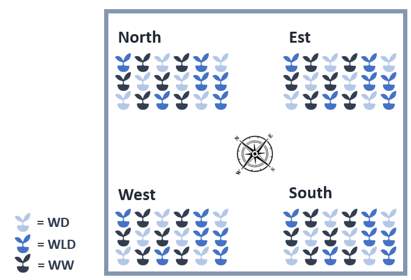

```{r setup, include = FALSE}
# Pour éviter que Rmd mette par défaut deux # au début de chaque ligne de code:
knitr::opts_chunk$set(comment="") 

# Liste des packages à charger
require(pander) # Afficher de jolis tableaux
panderOptions('missing', '') # Là où les données contiennent des Na, ne rien afficher
require(ggplot2)
theme_set(theme_classic()) # Afficher les graphes ggplot avec un fond blanc
# TP2:
library(car)
require(lme4)
require(lmerTest)
require(emmeans)
require(plot.matrix)
```

# Introduction  
Vous êtes un mémorant de la faculté d'agro de l'UCLouvain, et vous avez lu l'article publié par Fanchon de Serres (chercheuse du TP1) sur l'impact de l'irrigation sur la croissance de plants de maïs. Vous voudriez utiliser le même protocole pour étudier l'impact de l'irrigation sur la croissance d'une autre variété de maïs. Vous rencontrez cependant un problème; le budget qui vous est alloué par la faculté ne vous permet pas d'installer des capteurs de lumière dans la serre que vous avez à votre disposition. Pourtant, vous savez que l'exposition des plants dans la serre est très hétérogène et que cela risque d'influencer vos résultats.  

**Quelle solution pouvez-vous mettre en place pour palier à ce problème?**  
(Répondez à cette question avant de passer à la suite)  

Heureusement, vous avez assisté au cours LBRAI2222. Vous faites donc le plan suivant:  
  

Vous réalisez l'expérience et rassemblez les données dans un fichier CSV *data_TP3.csv*. Ce fichier contient les variables suivantes :

**M**: Biomasse accumulée sur une semaine ( poids frais, [g/plant])     
**W**: Régime d'irrigation (WW=Well Watered, WLD=Water light deficit, WD=Water deficit)     
**Loc**: Localisation de la table (North, South, West, East)    

**1. Avant toute chose, il s'agit d'explorer et de visualiser vos données afin d'avoir un premier apperçu des variables et éventuels problèmes que vous pourriez rencontrer.**  

Nous remarquons que nos données sont parfaitement balancées. Nous avons un **plan factoriel complet** à deux facteurs avec 6 répétitions.  
```{r}
mydata <- read.csv("TP3_data.csv")
pander(table(mydata[,c("W","Loc")]))
ggplot(mydata,aes(x=W,y=M, color = Loc)) + geom_point(alpha = 0.5, size=3) + 
               labs(x= "Watering",
                    y= "Biomass (FW) [g/plant]")
```

**2. Vous pouvez inclure le facteur 'Loc' de deux manières différentes dans votre modèle. Quelles sont-elles? Qu'est-ce qui justifierait le choix de l'une ou de l'autre? **  
Il peut être pris en compte comme  

* *Facteur fixe:*  
    + Si le chercheur veut connaître l'effet des différentes expositions dans sa serre sur la croissance des plants  
    + Ou s'il considère que toutes les expositions possibles sont inclues dans ses données

* *Facteur aléatoire:*  
    + Si le chercheur ne s'intéresse pas à l'effet des différentes expositions sur la croissance des plants mais souhaite prendre en compte la variation due à ce facteur dans son analyse  
    + Si tous les niveaux d'exposition possible ne sont pas présents dans l'expérience mais que le chercheur souhaite pouvoir généraliser ses conclusions à toutes les situations d'exposition.  

**3. Quel sera l'impact de ce choix sur la méthode d'estimation du modèle utilisé? **  
Pour un modèle contenant uniquement des facteurs fixes, c'est la méthode des moindres carrés qui sera utilisée pour estimer les paramètres du modèle. Si 'Loc' est considéré comme facteur aléatoire, c'est la méthode du maximum de vraisemblance restreint qui sera utilisée. 

# Modèle 1: ANOVA à un facteur
**4. Estimez un modèle à un facteur sans prendre en compte le facteur 'Loc' avec la fonction `lm`. À quoi correspondent les colonnes *estimates* dans le *summary* ?  **  

$(intercept) = \hat{\mu} + \hat{\alpha}_{WD}$  
$WWLD = \hat{\alpha}_{WLD} - \hat{\alpha}_{WD}$  
$WWW = \hat{\alpha}_{WW} - \hat{\alpha}_{WD}$ 

```{r}
mod1 <- lm(M ~ W, mydata)
summary(mod1)
anova(mod1) 
```

**5. Quelles sont les moyennes estimées de la biomasse accumulée pour les trois régimes d'irrigation?**  

$\hat{\mu}_{WD}=180.58$ g/plant   
$\hat{\mu}_{WLD}=180.58+32.91=213.49$ g/plant  
$\hat{\mu}_{WW}=180.58+92.02=272.6$  g/plant  

**6. Quel est le test fait dans l'anova?**  
$H_0$: $\alpha_{WD}=\alpha_{WLD}=\alpha_{WW}=0$  
$H_1$: Au moins un des $\alpha_{i} \ne 0$ 

**7. Pourquoi la Std. Error de l'intercept est-elle différente que celle de WWLD et WWW ?**

La *Std. Error* de l'intercept est celle associée à la **moyenne** alors que celle de WWLD et WWW est associée à une **différence** entre deux niveaux des effets du facteur watering.

Nous pouvons les retrouver à partir du tableau de l'ANOVA : 

$$Std. Error_{intercept} = \sqrt{\frac{S^2}{n}}= \sqrt{\frac{2568}{24}}=10.34 $$  
$$Std. Error_{WWLD} = Std. Error_{WWW} = \sqrt{\frac{2*S^2}{n}}= \sqrt{\frac{2*2568}{24}}=14.63 $$

# Modèle 2: ANOVA à 2 facteurs

**8. Réalisez maintenant un modèle en intégrant également le facteur 'Loc'. Comparez le résultat de l'anova pour le facteur W avec l'anova du premier modèle. Pourquoi la valeur F est-elle beaucoup plus grande dans le deuxième modèle?**  

Pour rappel, $F_{obs}=\frac{MSA}{MSE}$. Or, dans le premier modèle la variabilité liée à 'Loc' est inclue dans le $MSE$. La valeur de $MSE$ étant plus grande, le $F_{obs}$ sera plus petit et la p-valeur plus grande. Le fait d'inclure le facteur 'Loc' dans le deuxième modèle permet donc de diminuer la valeur du $MSE$ et de mettre en évidence avec plus de certitude un effet de $W$.  


```{r}
mod2 <- lm(M ~ W + Loc, mydata)
summary(mod2)
anova(mod2)
```

# Modèle 3: Modèle mixte

**9. Réalisez un troisième modèle en utilisant le facteur 'Loc' comme aléatoire. A l'aide de la fonction `lmerTest::show_tests`trouvez quelle est la matrice $L$ utilisée par R pour réaliser le test de l'anova du troisième modèle sous forme de constrast ? **

```{r}
mod3 <- lmer(M ~ W + (1|Loc), mydata)
summary(mod3)
anova(mod3) 
ranova(mod3)
```


```{r}
test <- lmerTest::show_tests(anova(mod3))
L <- test$W
pander(L)
```

**10. Donnez l'hypothèse $H_0$ du test effectué.**  
$H_0:$ $\alpha_{WLD} = \frac{\alpha_{WD} + \alpha_{WW}}{2}$ et $\alpha_{WD}=\alpha_{WW}$

**11. Donnez la matrice L telle qu'elle serait utilisée avec votre matrice X complète.**  
$L = \left( \begin{array}{cccc} 0&1&-0.5&-0.5\\ 0&0&1&-1 \end{array} \right)$

**12. Comment pouvez-vous effectuer le même test à l'aide de la fonction `lmerTest::contest`?**  

```{r}
lmerTest::contest(mod3, L, joint=T) #joint = T signifie que les deux lignes de la matrice sont un seul test et pas deux test différents
```

# Comparaison des modèles
## Intervalles de confiance

**13. Calculez les intervales de confiances pour chaque niveau du facteur *w* pour les trois modèles **

```{r}
emmeans(mod1, ~W)
emmeans(mod2, ~W)
emmeans(mod3, ~W)
```
**14. Comment sont calculés les SE et les df pour les modèles 1 et 2?**  
*Modèle 1:*  
Tous les $Y_i$ sont indépendants et ont la même variance $S^2=2568$. Comme nous avons 24 observations par niveau d'irrigation, l'écart-type de la moyenne pour chaque niveau est $SE=\sqrt{\frac{2568}{24}}=10.34$

$Df=69=72-df_{W}-1=72-2-1=69$  

*Modèle 2:*  
Tous les $Y_{ij}$ sont indépendants et ont la même variance $S^2=1026$. Comme nous avons 24 observations par niveau d'irrigation, l'écart-type de la moyenne pour chaque niveau est $SE=\sqrt{\frac{1026}{24}}=6.54$  

$Df=66=72-df_{W}- df_{Loc}-1=72-2-3-1=66$  

**15. Pourquoi y a-t-il une grande différence entre les intervalles de confiance des différents modèles?**  

Ici la différence entre les IC est importante parce que la variance liée au facteur 'Loc' est grande. 

## Tests
**16. Trouvez deux manières différentes de faire un test sur la différence attendue de croissance des plants entre les régimes d'irrigation $WLD$ et $WW$ (sur base du modèle 3).**  
```{r}
pairs(emmeans(mod3, ~W))
lmerTest::contest(mod3, c(0,1,-1), joint=F)
```


**17. Dans la fonction `lmerTest::contest`, à quoi sert l'option *joint*? Quel est le test qui est effectué selon que l'on utilise *joint=T* ou *joint=F*? **  

Pour répondre à cette question, nous reprenons le code utilisé précédamment avec la matrice *L* en testant *joint=T* et *joint=F*. 

- Lorsque *joint=T* est effectué : si la matrice *L* comporte plusieurs lignes, la fonction réalisera un test F en prenant en compte toutes les lignes ensembles.

- Lorsque *joint=F* est effectué : si la matrice *L* comporte plusieurs lignes, la fonction réalisera un test t pour chacune des lignes.

```{r}
lmerTest::contest(mod3, L, joint=T)
lmerTest::contest(mod3, L, joint=F)
```

Dans le cas où la matrice L ne contient qu'une seule ligne, les deux tests donnent le même résultat:

```{r}
lmerTest::contest(mod3, c(0,1,-1), joint=T)
lmerTest::contest(mod3, c(0,1,-1), joint=F)
```


